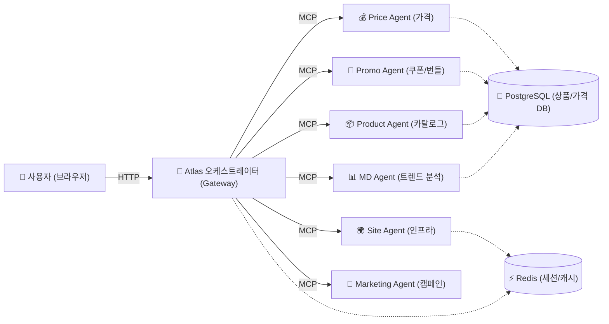
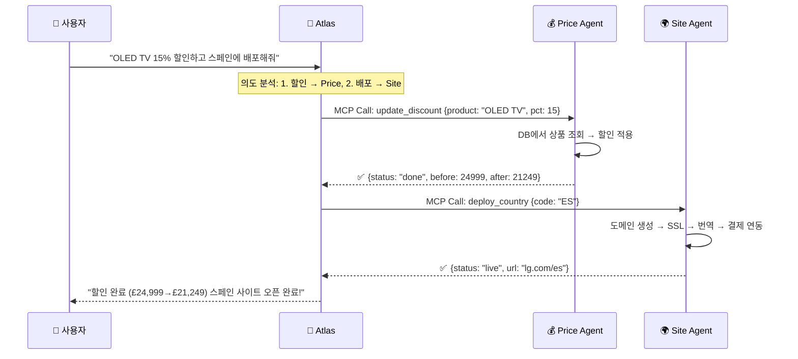
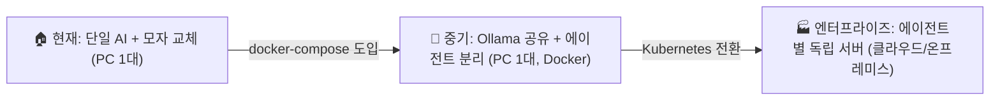

# 🏗️ Docker + MCP 멀티 에이전트 아키텍처 상세 설계

## 전체 구조도



---

## 핵심 개념: 각 컨테이너가 하는 일

### Atlas (오케스트레이터) — 지휘자
```
사용자: "OLED TV 15% 할인하고, 번들도 만들어줘"

Atlas의 판단:
  1. "할인" → Price Agent에게 MCP 호출
  2. "번들" → Promo Agent에게 MCP 호출
  3. 두 결과를 모아서 사용자에게 답변
```

Atlas는 **직접 일을 하지 않습니다.** 사용자 의도를 파악하고, 어떤 에이전트를 호출할지 결정하는 **라우터** 역할만 합니다.

### 각 에이전트 컨테이너 — 실무자

| 컨테이너 | 내부 구성 | 전용 도구 | 전용 데이터 |
|----------|----------|----------|------------|
| **Price Agent** | Gemma4 + 가격 로직 | `set_price`, `update_discount` | 가격 이력 DB |
| **Promo Agent** | Gemma4 + 쿠폰 엔진 | `create_coupon`, `create_bundle` | 쿠폰 발급 이력 |
| **Product Agent** | Gemma4 + 카탈로그 | `add_product`, `update_spec` | 상품 마스터 DB |
| **MD Agent** | Gemma4 + 분석 엔진 | `reorder_catalog`, `analyze_trend` | 판매 데이터 |
| **Site Agent** | Gemma4 + 인프라 | `deploy_country`, `change_theme` | 배포 설정 |
| **Marketing** | Gemma4 + 캠페인 | `create_campaign`, `ab_test` | 캠페인 DB |

---

## Docker Compose 구성 예시

```yaml
# docker-compose.yml
version: '3.8'

services:
  # ==================== 오케스트레이터 ====================
  atlas:
    build: ./agents/atlas
    ports:
      - "3000:3000"          # 사용자 접속 포트
    environment:
      - MCP_PRICE_URL=http://price-agent:8001
      - MCP_PROMO_URL=http://promo-agent:8002
      - MCP_PRODUCT_URL=http://product-agent:8003
      - MCP_MD_URL=http://md-agent:8004
      - MCP_SITE_URL=http://site-agent:8005
      - MCP_MARKETING_URL=http://marketing-agent:8006
    depends_on:
      - price-agent
      - promo-agent
      - product-agent

  # ==================== 전문 에이전트들 ====================
  price-agent:
    build: ./agents/price
    ports: ["8001:8000"]
    environment:
      - OLLAMA_URL=http://ollama:11434
      - OLLAMA_MODEL=gemma4:e4b
      - DB_URL=postgresql://db:5432/commerce
    volumes:
      - ./data/price-rules:/app/rules   # 가격 정책 파일

  promo-agent:
    build: ./agents/promo
    ports: ["8002:8000"]
    environment:
      - OLLAMA_URL=http://ollama:11434
      - OLLAMA_MODEL=gemma4:e4b
      - DB_URL=postgresql://db:5432/commerce

  product-agent:
    build: ./agents/product
    ports: ["8003:8000"]
    environment:
      - OLLAMA_URL=http://ollama:11434
      - OLLAMA_MODEL=gemma4:e4b

  md-agent:
    build: ./agents/md
    ports: ["8004:8000"]
    environment:
      - OLLAMA_URL=http://ollama:11434
      - OLLAMA_MODEL=gemma4:e4b

  site-agent:
    build: ./agents/site
    ports: ["8005:8000"]
    environment:
      - OLLAMA_URL=http://ollama:11434
      - OLLAMA_MODEL=gemma4:e4b

  marketing-agent:
    build: ./agents/marketing
    ports: ["8006:8000"]
    environment:
      - OLLAMA_URL=http://ollama:11434
      - OLLAMA_MODEL=gemma4:e4b

  # ==================== 공유 인프라 ====================
  ollama:
    image: ollama/ollama:latest
    ports: ["11434:11434"]
    volumes:
      - ollama-data:/root/.ollama
    deploy:
      resources:
        reservations:
          devices:
            - capabilities: [gpu]    # GPU 공유

  db:
    image: postgres:16
    environment:
      - POSTGRES_DB=commerce
      - POSTGRES_PASSWORD=secret
    volumes:
      - pgdata:/var/lib/postgresql/data

  redis:
    image: redis:7-alpine
    ports: ["6379:6379"]

volumes:
  ollama-data:
  pgdata:
```

---

## MCP 통신 흐름 (구체적 시나리오)

### 시나리오: "OLED TV 15% 할인하고 스페인에 배포해줘"



### 현재 방식과의 차이

| 단계 | 현재 (모자 교체) | Docker + MCP |
|------|---------------|--------------|
| 1. 의도 파악 | Gemma4가 한 번에 판단 | Atlas가 판단 |
| 2. 할인 실행 | 같은 Gemma4가 도구 호출 | Price 컨테이너에 MCP 요청 |
| 3. 배포 실행 | 별도 delegate필요 | Site 컨테이너에 MCP 요청 (**병렬 가능!**) |
| 4. 결과 종합 | 수동 체인 | Atlas가 자동 종합 |

---

## 각 에이전트 내부 구조

```
agents/price/
├── Dockerfile
├── server.py           # MCP 서버 (FastAPI + MCP SDK)
├── tools/
│   ├── set_price.py    # 가격 변경 도구
│   └── discount.py     # 할인 적용 도구
├── prompts/
│   └── system.txt      # Price Agent 전용 시스템 프롬프트
└── config.yaml         # 모델, DB 연결 설정
```

```python
# agents/price/server.py (개념 예시)
from mcp.server import MCPServer
from tools.discount import apply_discount

server = MCPServer("price-agent")

@server.tool("update_discount")
async def update_discount(product_name: str, discount_pct: int):
    """특정 상품에 할인을 적용합니다."""
    # 1. AI가 상품 DB에서 검색
    product = await db.find_product(product_name)
    # 2. 할인 적용 (실제 DB 업데이트)
    result = await apply_discount(product.id, discount_pct)
    # 3. 결과 반환
    return {"status": "done", "product": product.name, "new_price": result.price}

server.run(port=8000)
```

---

## 3단계 진화 로드맵



| 단계 | Ollama | 에이전트 | DB | 필요 자원 |
|------|--------|---------|-----|----------|
| **현재** | 1개 | `api/gemini.js` 1개 | 없음 (메모리) | RAM 16GB |
| **중기** | 1개 (공유) | Docker 7개 | PostgreSQL 1개 | RAM 32GB + GPU |
| **엔터프라이즈** | 에이전트당 1개 | K8s Pod 7개+ | 분산 DB | 서버 다수 |

---

## 필요 인프라 요구사항

### 중기 단계 (사장님 실행 가능)
- **RAM**: 32GB 이상 (G강의4 10GB + Docker 오버헤드)
- **GPU**: VRAM 12GB 이상 (Ollama 1개가 공유)
- **저장소**: SSD 50GB+
- **소프트웨어**: Docker Desktop, Ollama

### 엔터프라이즈 단계
- **서버**: 각 에이전트별 GPU 서버 또는 클라우드 GPU (A100/H100)
- **오케스트레이션**: Kubernetes
- **모니터링**: Prometheus + Grafana
- **로드밸런싱**: 에이전트별 수평 스케일링
